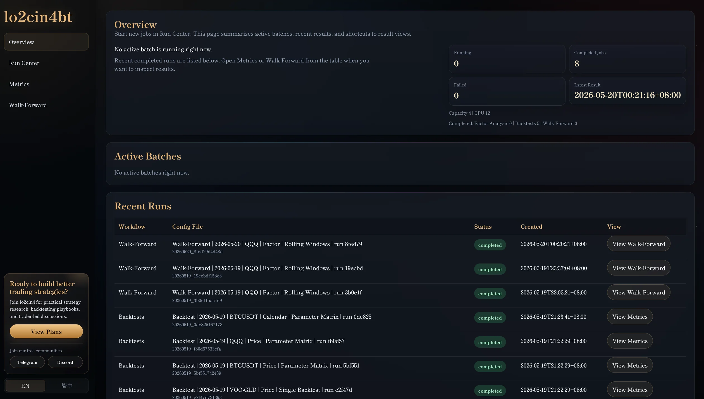
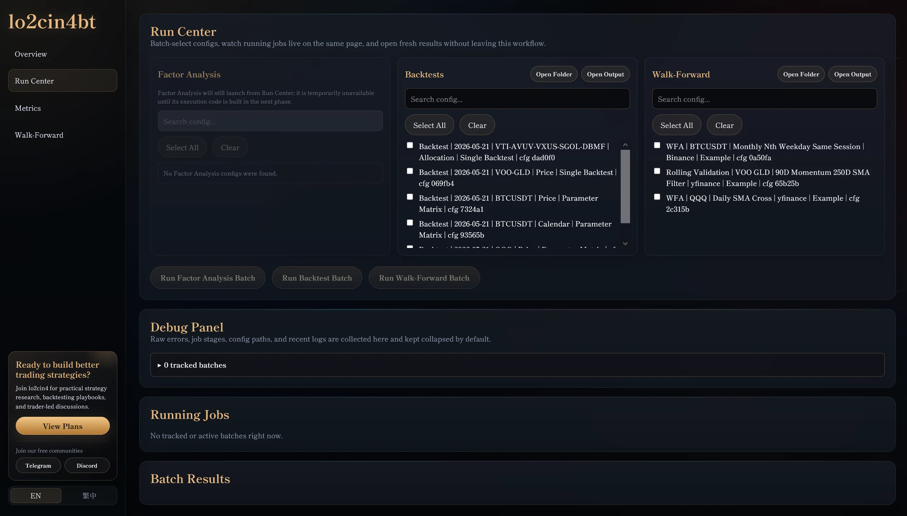

# lo2cin4bt 2.0

[繁體中文](README.md)


> You are the PM for lo2cin4. Delegate to sub agents to build a BTCUSDT daily dual-moving-average strategy with beginner-safe defaults; run local backtests only and do not run live trading.

## What Is lo2cin4bt

lo2cin4bt is a quantitative strategy research and backtesting platform. Start from a strategy idea, let AI create a strategy config, run the backtest locally, and inspect the result in the browser app.

Note: lo2cin4bt is not financial advice, live-trading software, or an order-routing system.

## Why Choose lo2cin4bt

- **Open source**: users can inspect how the framework handles data, signals, and backtest results.
- **Runs locally**: data and strategy research stay on your own machine.
- **Beginner-friendly workflow**: describe the idea to AI, let it create workspace files, then review the result in the browser.
- **Backtesting and visualization together**: single backtests, parameter matrices, WFA, and result pages are part of one local workflow.
- **Flexible data and assets**: local files and market-data sources can be used when their format and availability are clearly defined.
- **AI with clear boundaries**: AI creates docs and configs that match user requirements and code constraints; it does not invent engine behavior.
- **Traceable results**: each result should trace back to its config, data source, cost, slippage, benchmark, and generated artifacts.
- **Practical safety checks**: workspace checks, config validation, fixed-example regression tests, frontend/backend display checks, and quant review help catch common mistakes.

## Three-Step Quick Start

1. On GitHub, click `<> Code`, choose `Download ZIP`, then unzip the folder.
2. Ask your AI agent to read the whole folder and act as the lo2cin4bt PM.
3. Copy this prompt to AI:

```text
You are the PM for lo2cin4bt. Read AGENTS.md, README.en.md, agents/lo2cin4bt_PM.agent.md, and the required skills/docs. Tell me which sub-agents are available, what each one does, and what I can ask you to do as a beginner. Do not run live trading or place orders.
```

## What Beginners Should Be Able To Do

- Start lo2cin4bt successfully.
- Open the browser-based backtest platform.
- Find and run the built-in strategy examples.
- Try all 5 built-in backtest examples.
- Review results, charts, metrics, holdings, and trade records.
- Open the HTML lecture or related tutorial docs.
- Use the `lo2cin4bt_Teacher` AI agent to learn how the platform works.
- Use the `lo2cin4bt_StrategyBuilderSubAgent` AI agent to try building a strategy.
- Let `lo2cin4bt_PM` coordinate the other AI agents to check whether a strategy is supported by the framework and whether it has obvious bias risks.

## What Beginners Should Not Need Or Encounter

- You should not need to edit core code outside `workspace/` for normal use.
- AI agents should not create a strategy with obvious look-ahead bias without warning you.
- Unsupported strategy logic should not be disguised as a runnable config.
- The software should not guide you into real orders, live trading, fund movement, or broker account setting changes.
- You should not need to submit API keys, broker passwords, private data, or other sensitive information.

## Beginner-Safe Workspace

When researching strategies, treat `workspace/` as the safe working area. Local input data, runnable strategy configs, WFA configs, custom indicators, and AI notes should start there.

- Data files: `workspace/datasets/`
- Runnable backtest configs: `workspace/runs/`
- WFA configs: `workspace/wfa/`
- External data contracts: `workspace/features/`
- Custom indicators: `workspace/indicators/extensions/`
- AI notes or review records: `workspace/reports/agents/`

For normal strategy research, AI should create or edit files inside `workspace/` only. It should not need to change `app/`, `backtester/`, `dataloader/`, `autorunner/`, `wfanalyser/`, `metricstracker/`, or `plotter/`.

If a strategy uses external data, such as IPO dates, earnings releases, index membership, sentiment data, or your own CSV files, AI must state when that data would have been known in real life. This prevents the backtest from accidentally looking into the future. For example, data published after the market close cannot be used for a same-day market-open trade. These data contracts usually live in `workspace/features/` and should pass the workspace checks. Data marked as revised history is research/demo data or requires further review; it is not proof of point-in-time, bias-free availability.

## Local Backtest Flow

1. Copy this prompt to AI:

```text
You are lo2cin4bt/agents/lo2cin4bt_PM.agent.md. Read agents/lo2cin4bt_PM.agent.md first, then load the required skills and docs.
Delegate to the appropriate agent/skill to create a BTCUSDT daily dual-moving-average strategy with default settings. Run local backtests only; do not trade live.
Check the environment, launch the local app, and open or reuse one http://127.0.0.1:2424/ browser tab. In Run Center, select the BTCUSDT daily dual-MA config, run the backtest, then open the Metrics result page and briefly report whether it succeeded.
```

2. Wait for AI to finish the run and open the visualization.

## Install

Windows:

```powershell
git clone <repository-url> lo2cin4bt
cd lo2cin4bt
.\scripts\setup.ps1
.\.venv\Scripts\python.exe main.py
```

macOS / Linux:

```bash
git clone <repository-url> lo2cin4bt
cd lo2cin4bt
bash scripts/setup.sh
.venv/bin/python main.py
```

Open:

```text
http://127.0.0.1:2424/
```

Storage reference: a Windows clean install used about 1.2 GB of local disk space, including about 800 MB for `.venv/` and about 350 MB for `plotter/web/node_modules/`. Backtest results are written under `outputs/` and grow over time. These local artifacts are gitignored and should not be uploaded to GitHub.

See [`docs/INSTALL.md`](docs/INSTALL.md) for detailed setup and [`Troubleshooting.md`](Troubleshooting.md) for common issues.

## BTCUSDT Daily Dual MA Demo

Included example:

```text
backtester/contracts/strategy/examples/strategy-run-btcusdt-binance-daily-dual-ma-example.json
```

On first app launch, Run Center copies included examples into local `workspace/runs/`. To recreate it manually:

Windows:

```powershell
New-Item -ItemType Directory -Force workspace\runs
Copy-Item backtester\contracts\strategy\examples\strategy-run-btcusdt-binance-daily-dual-ma-example.json workspace\runs\strategy-run-btcusdt-binance-daily-dual-ma-example.json
```

macOS / Linux:

```bash
mkdir -p workspace/runs
cp backtester/contracts/strategy/examples/strategy-run-btcusdt-binance-daily-dual-ma-example.json workspace/runs/strategy-run-btcusdt-binance-daily-dual-ma-example.json
```

Beginner-safe assumptions include:

- Short MA from `10` to `90`
- Long MA from `100` to `150`
- Workflow: Parameter Matrix
- Cost and slippage explicitly declared in `fill_model`
- No live trading

## Fixed Allocation Demo

```text
backtester/contracts/strategy/examples/strategy-run-vti-avuv-vxus-sgol-dbmf-yfinance-yearly-rebalance-example.json
```

Windows:

```powershell
New-Item -ItemType Directory -Force workspace\runs
Copy-Item backtester\contracts\strategy\examples\strategy-run-vti-avuv-vxus-sgol-dbmf-yfinance-yearly-rebalance-example.json workspace\runs\strategy-run-vti-avuv-vxus-sgol-dbmf-yfinance-yearly-rebalance-example.json
```

macOS / Linux:

```bash
mkdir -p workspace/runs
cp backtester/contracts/strategy/examples/strategy-run-vti-avuv-vxus-sgol-dbmf-yfinance-yearly-rebalance-example.json workspace/runs/strategy-run-vti-avuv-vxus-sgol-dbmf-yfinance-yearly-rebalance-example.json
```

## Platform Screenshots And Walkthrough

### Overview



### Run Center



Full English walkthrough: <https://youtu.be/03CduKFc4sg?si=GE7Y2EFKnsiF3HFV>

## Currently Supported Strategy Examples

- Single-asset signal strategies such as moving-average crossovers.
- Calendar / session event strategies.
- Multi-asset portfolios.
- Fixed weights and scheduled rebalancing.
- Momentum rotation / top-N selection.
- Parameter Matrix.
- WFA / rolling validation.
- Custom feature contracts and indicator extensions.

If a strategy needs behavior the engine does not support yet, AI should stop and explain the missing capability instead of using synthetic price series or filename inference to pretend support exists.

## Connected Data Sources

| Logo | Source | Data | Status | Entry / Notes |
| --- | --- | --- | --- | --- |
|  | `yfinance` | ETF, stocks, beginner examples | ✅ | No account required for market data. |
|  | `binance` | Crypto spot klines / OHLCV, such as BTCUSDT | ✅ | No account required for market data. If you need an account, [this referral link](https://accounts.binance.com/zh-TC/register?ref=LO2CIN4) may provide account-opening benefits. |
|  | `coinbase` | Coinbase product format, such as `BTC-USD` | ✅ | No account required for market data. |
|  | Local files | CSV, Parquet, research datasets | ✅ | Put private datasets under `workspace/datasets/`. |
|  | `futu` | Advanced HK / US market data | 🧪 | Enter `AZ57KU` in the redeem center for account-opening benefits. |
|  | `ibkr` | Advanced stocks, ETFs, futures market data | 🧪 | Official link: <https://www.interactivebrokers.com/> |

lo2cin4bt currently does not support order placement.

## Development Status

lo2cin4bt aims to keep strategy ideas inside a documented, checkable research workflow instead of letting AI create one-off scripts that cannot be reviewed. The next development focus is user-facing research capability:

- Combined multi-strategy performance views.
- High-frequency Sharpe Ratio adjustments for shorter-horizon strategies.
- Stronger parameter-matrix, WFA, and stress-test workflows.
- Clearer ways to share strategy configs and completed result bundles.
- Easier workspace flows for custom data, custom indicators, and custom strategies.

## Future Goals

- Broaden golden regression strategy coverage.
- Raise core module coverage.
- Strengthen clean-clone release checks.
- Simplify custom indicator onboarding.
- Keep frontend display aligned with backend payload truth.
- Add more QuantReview-approved strategy building blocks.

## Docs

- [Tutorial](docs/TUTORIAL.md)
- [Install](docs/INSTALL.md)
- [Quality Gates](docs/QUALITY_GATES.md)
- [Quant Validation Gates](docs/QUANT_VALIDATION_GATES.md)
- [Repository Structure](docs/REPOSITORY_STRUCTURE.md)
- [Strategy Building Blocks](docs/STRATEGY_BUILDING_BLOCKS.md)
- [Security Policy](SECURITY.md)
- [Contributing](CONTRIBUTING.md)
- [Troubleshooting](Troubleshooting.md)

## AI Docs

- [`skills/lo2cin4bt/SKILL.md`](skills/lo2cin4bt/SKILL.md)
- [`docs/ai/AI_MANUAL_SKILL.md`](docs/ai/AI_MANUAL_SKILL.md)
- [`docs/ai/AI_SKILL_LECTURE_GUIDE.md`](docs/ai/AI_SKILL_LECTURE_GUIDE.md)
- [`skills/lo2cin4bt/agents/openai.yaml`](skills/lo2cin4bt/agents/openai.yaml)

## License

See [`LICENSE`](LICENSE). Backtest results are research evidence only, not investment advice or performance promises.

## Contact / Business

For collaboration, teaching, research workflow design, or business inquiries, contact lo2cin4 through [Telegram](https://t.me/lo2cin4group) or [Discord](https://discord.gg/sSnZuq3DNu).
