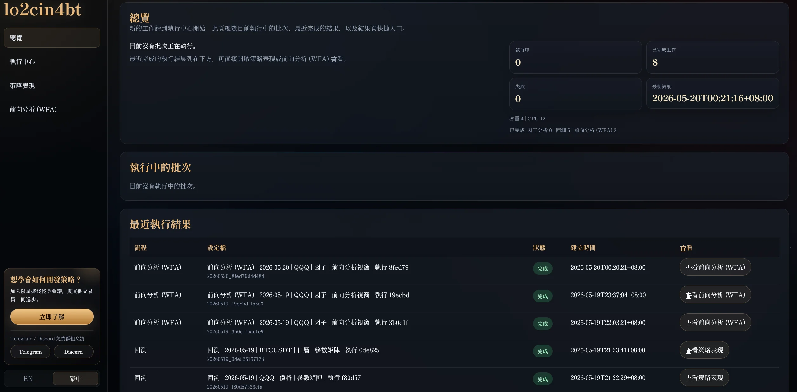
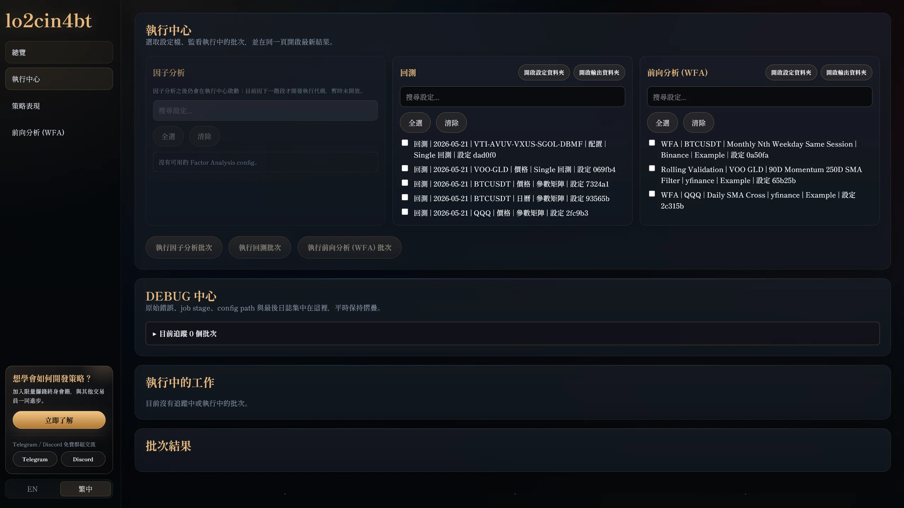

# lo2cin4bt 2.0

[English](README.en.md)


> 你現在是 lo2cin4 的 PM。派 sub agent 幫我開發 BTCUSDT 日線雙均線交易策略，其他參數用新手安全預設；只做本機回測，不要實盤交易。

## 甚麼是 lo2cin4bt

lo2cin4bt 是量化策略研究與回測平台。你可以由一句策略想法開始，讓 AI 建立策略設定檔，在本機跑回測，並在瀏覽器打開回測平台檢測結果。

留意：lo2cin4bt 並非投資建議、實盤交易軟件或下單系統。

## 為何使用 lo2cin4bt

- **完全開源**：用戶可瀏覽所有代碼，理解框架如何處理資料、訊號和回測結果。
- **本地運行**：完全在本地主機運行，策略和資料不用上傳到雲端。
- **新手也可開始**：先把策略想法交給 AI，由 AI 建立工作區設定，再用瀏覽器檢查結果。
- **回測與視覺化整合**：同一套流程可處理單次回測、參數矩陣、WFA 和結果頁。
- **支援多種資料與資產**：只要資料格式和時間可用性寫清楚，就可以接入本機資料或行情來源。
- **AI 有清楚邊界**：AI 只負責建立合乎用戶要求與代碼條件的文檔和設定，不會自行發明引擎能力。
- **結果可追蹤**：每次回測都應能追溯到設定檔、資料來源、成本、滑價、基準和產物。
- **有防錯門檻**：工作區檢查、設定格式檢查、固定範例回歸測試、前後端顯示一致性檢查和量化審查，會幫助阻止常見低級錯誤。

## 三步快速使用 lo2cin4bt

1. 在 GitHub 右上角點擊 `<> Code`，選擇 `Download ZIP`，下載後解壓。
2. 讓 AI 代理讀取整個資料夾，並請它扮演 lo2cin4bt PM。
3. 複製以下提示詞給 AI：

```text
你現在是 lo2cin4bt 的 PM。請閱讀 AGENTS.md、README.md、agents/lo2cin4bt_PM.agent.md，以及必要的 skills 和 docs。請告訴我目前有哪些 sub-agents、每個 sub-agent 負責甚麼，以及我作為新手可以請你做甚麼。之後詢問我是否需要安裝必要部件並運行前端可視化平台。
```

## 新手應該能做到的事情

- 成功啟動 lo2cin4bt。
- 在瀏覽器打開可視化回測平台。
- 在平台上找到並執行內建回測策略範例。
- 嘗試回測 5 個內建策略範例。
- 查看回測結果、圖表、指標、持倉與交易紀錄。
- 打開教學 HTML 或相關教學文件。
- 使用 AI 代理 `lo2cin4bt_Teacher` 學習平台操作方式。
- 使用 AI 代理 `lo2cin4bt_StrategyBuilderSubAgent` 嘗試開發策略。
- 由 AI 代理 `lo2cin4bt_PM` 協調其他 AI 代理，檢查策略是否可行、是否符合框架支援範圍，以及是否存在明顯偏誤風險。

## 新手不應該遇到的事情

- 不應該需要修改 `workspace/` 以外的核心代碼才能正常使用。
- AI 代理不應該建立有明顯前視偏誤的策略而完全沒有警告。
- 程式不應該把目前尚未支援的策略邏輯偽裝成可執行設定。
- 程式不應該引導你進行真實下單、實盤交易、移動資金或修改券商帳戶設定。
- 不應該需要提交 API key、券商密碼、私人資料或任何敏感資訊。

## 新手安全工作區

研究策略時，可以把 `workspace/` 視為安全工作區。你的本機輸入資料、可執行策略設定、WFA 設定、自訂指標和 AI 筆記，都應該先放在 `workspace/` 內。

- 資料檔案：`workspace/datasets/`
- 可執行回測設定：`workspace/runs/`
- WFA 設定：`workspace/wfa/`
- 外部資料合約：`workspace/features/`
- 自訂指標：`workspace/indicators/extensions/`
- AI 筆記或審查紀錄：`workspace/reports/agents/`

正常研究策略時，AI 應該只會在 `workspace/` 內建立或修改檔案，而不需要修改 `app/`、`backtester/`、`dataloader/`、`autorunner/`、`wfanalyser/`、`metricstracker/` 或 `plotter/`。

如果策略使用外部資料，例如 IPO 日期、財報、指數成份、情緒指標或你自己的 CSV，AI 必須寫清楚「這份資料在現實中何時才知道」。這是為了避免回測偷看未來。例子：收盤後才公布的資料，不能拿來做同一天開盤的交易決定。這類資料通常要放在 `workspace/features/`，並通過工作區檢查。若資料標記為會修訂歷史，代表它只適合作為研究示範或需再審查，不能當作已證明逐時點無偏誤。

## 回測示例

1. 複製這個文字框中的全部內容給 AI：

```text
你現在是 lo2cin4bt/agents/lo2cin4bt_PM.agent.md。請先閱讀 agents/lo2cin4bt_PM.agent.md，並按它的指示讀取必要的技能和文件。
派出合適的代理使用技能去開發 BTCUSDT 日線雙均線交易策略，其他參數用預設；只做本機回測，不要實盤交易。
請完成環境檢查、啟動本機應用程式，並只打開或重用一個 http://127.0.0.1:2424/ 前端分頁。進入「執行中心」選取 BTCUSDT 日線雙均線設定檔，跑本機回測；完成後在同一個前端分頁打開「策略表現」結果頁，簡短說明是否成功。
```

2. 等待 AI 完成回測並打開可視化平台。

## 安裝

Windows:

```powershell
git clone <repository-url> lo2cin4bt
cd lo2cin4bt
.\scripts\setup.ps1
.\.venv\Scripts\python.exe main.py
```

macOS / Linux:

```bash
git clone <repository-url> lo2cin4bt
cd lo2cin4bt
bash scripts/setup.sh
.venv/bin/python main.py
```

開啟：

```text
http://127.0.0.1:2424/
```

安裝容量參考：Windows 乾淨安裝實測約需 1.2 GB 本機空間，其中 `.venv/` 約 800 MB，`plotter/web/node_modules/` 約 350 MB；回測結果會另外寫入 `outputs/`。這些本機產物已被 `.gitignore` 忽略，不會上傳到 GitHub。

更完整安裝說明見 [`docs/INSTALL.md`](docs/INSTALL.md)。常見問題見 [`Troubleshooting.md`](Troubleshooting.md)。

## 內建 BTCUSDT 日線雙均線示範

內建示範檔：

```text
backtester/contracts/strategy/examples/strategy-run-btcusdt-binance-daily-dual-ma-example.json
```

第一次開啟 app 時，「執行中心」會自動把內建示範複製到本機 `workspace/runs/`。如果需要手動重建：

Windows:

```powershell
New-Item -ItemType Directory -Force workspace\runs
Copy-Item backtester\contracts\strategy\examples\strategy-run-btcusdt-binance-daily-dual-ma-example.json workspace\runs\strategy-run-btcusdt-binance-daily-dual-ma-example.json
```

macOS / Linux:

```bash
mkdir -p workspace/runs
cp backtester/contracts/strategy/examples/strategy-run-btcusdt-binance-daily-dual-ma-example.json workspace/runs/strategy-run-btcusdt-binance-daily-dual-ma-example.json
```

這個範例使用 Binance 的 BTCUSDT 日線資料，策略邏輯是短均線上穿長均線進場、短均線下穿長均線出場。新手安全預設包含：

- 短均線：`10` 至 `90`
- 長均線：`100` 至 `150`
- 工作流：參數矩陣
- 成本與滑價：明確寫在 `fill_model`
- 不做實盤交易

## 內建固定配置示範

```text
backtester/contracts/strategy/examples/strategy-run-vti-avuv-vxus-sgol-dbmf-yfinance-yearly-rebalance-example.json
```

手動複製：

Windows:

```powershell
New-Item -ItemType Directory -Force workspace\runs
Copy-Item backtester\contracts\strategy\examples\strategy-run-vti-avuv-vxus-sgol-dbmf-yfinance-yearly-rebalance-example.json workspace\runs\strategy-run-vti-avuv-vxus-sgol-dbmf-yfinance-yearly-rebalance-example.json
```

macOS / Linux:

```bash
mkdir -p workspace/runs
cp backtester/contracts/strategy/examples/strategy-run-vti-avuv-vxus-sgol-dbmf-yfinance-yearly-rebalance-example.json workspace/runs/strategy-run-vti-avuv-vxus-sgol-dbmf-yfinance-yearly-rebalance-example.json
```

## 平台畫面與示範影片

### 總覽



### 執行中心



完整中文示範影片：<https://youtu.be/XIPYRn3H0tU?si=5RoLzrmGLEG6uxaD>

## 目前支援的策略例子

- 單資產訊號策略，例如均線交叉。
- Calendar / session event 策略。
- 多資產投資組合。
- 固定權重與定期再平衡。
- Momentum rotation / top-N selection。
- Parameter Matrix。
- WFA / rolling validation。
- 自訂資料合約與自訂 indicator extension。

如果策略需要目前引擎未支援的能力，AI 應該停下來說明缺少甚麼功能，不應用人造價格曲線或檔名推斷去假裝支援。

## 連接數據源

| Logo | 數據源 | 數據 | 狀態 | 連結 |
| --- | --- | --- | --- | --- |
|  | `yfinance` | ETF、股票、新手教學和美股範例 | ✅ | 無須開戶亦可連結行情數據。 |
|  | `binance` | 加密貨幣現貨 K 線 / OHLCV，例如 BTCUSDT | ✅ | 無須開戶亦可連結行情數據。 |
|  | `coinbase` | 加密貨幣 product 格式，例如 `BTC-USD` | ✅ | 無須開戶亦可連結行情數據。 |
|  | 本機檔案 | CSV、Parquet、研究資料集 | ✅ | 放在 `workspace/datasets/`，適合私有資料。 |
|  | `futu` | 港股、美股等進階行情數據 | 🧪 | 只作行情資料用途；需按官方文件完成只讀資料設定。 |
|  | `ibkr` | 股票、ETF、期貨等進階行情數據 | 🧪 | 官方連結：<https://www.interactivebrokers.com/> |

lo2cin4bt 目前尚不支持下單功能。

## 開發目標與進度

lo2cin4bt 的目標是把策略想法放進已規範的回測流程，而不是讓 AI 自由寫不可檢查的腳本。未來會集中在用戶真正會用到的研究能力：

- 合成多策略績效，方便比較多個策略或投資組合。
- 高頻 Sharpe Ratio 調整，避免用錯日頻假設解讀短週期策略。
- 更完整的參數矩陣、WFA 和壓力測試流程。
- 更清楚的策略分享與結果分享方式。
- 更低門檻的自訂資料、自訂指標和自訂策略工作區。

## 未來開發目標

- 擴大 golden regression 策略類型。
- 提升核心模組 coverage。
- 加強 clean-clone release 驗收。
- 強化自訂 indicator 的低門檻使用流程。
- 繼續收緊前端顯示與後端 payload 一致性。
- 逐步補齊更多經 QuantReview 的策略 building blocks。

## 文件

- [Tutorial](docs/TUTORIAL.md)
- [Install](docs/INSTALL.md)
- [Quality Gates](docs/QUALITY_GATES.md)
- [Quant Validation Gates](docs/QUANT_VALIDATION_GATES.md)
- [Repository Structure](docs/REPOSITORY_STRUCTURE.md)
- [Strategy Building Blocks](docs/STRATEGY_BUILDING_BLOCKS.md)
- [Security Policy](SECURITY.md)
- [Contributing](CONTRIBUTING.md)
- [Troubleshooting](Troubleshooting.md)

## AI 文件

- [`skills/lo2cin4bt/SKILL.md`](skills/lo2cin4bt/SKILL.md)
- [`docs/ai/AI_MANUAL_SKILL.md`](docs/ai/AI_MANUAL_SKILL.md)
- [`docs/ai/AI_SKILL_LECTURE_GUIDE.md`](docs/ai/AI_SKILL_LECTURE_GUIDE.md)
- [`skills/lo2cin4bt/agents/openai.yaml`](skills/lo2cin4bt/agents/openai.yaml)

## 授權聲明

本專案以開源形式提供，詳情請見 [`LICENSE`](LICENSE)。回測結果只供研究，不構成投資建議或收益承諾。

## 聯絡方式或商務合作

如需合作、教學、研究流程設計或商務聯絡，請透過 [Telegram](https://t.me/lo2cin4group) 或 [Discord](https://discord.gg/sSnZuq3DNu) 聯絡 lo2cin4。
